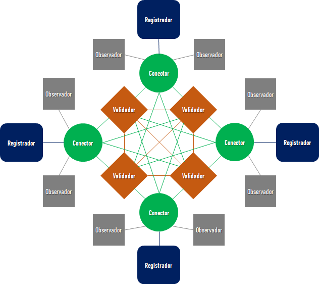

# Rede Blockchain Brasil

Bem vindo à Rede Blockchain Brasil!

A Rede Blockchain Brasil (RBB) é uma rede de instituições, de abrangência nacional, composta de estrutura de governança e infraestrutura tecnológica, que tem o objetivo de facilitar a adoção da tecnologia de blockchain para a implementação de aplicações de interesse público. A criação da rede permitirá a otimização de recursos, redução de custos e remoção de barreiras de entrada para uso da tecnologia e a inovação no setor público.

A RBB foi fundada pelo **Banco Nacional de Desenvolvimento Econômico e Social** (BNDES) e o **Tribunal de Contas da União** (TCU), através de um [Acordo de Cooperação](documentos/ACT_TCU_BNDES_RBB.pdf), [assinado em 12/04/2022](https://www.in.gov.br/web/dou/-/extrato-do-acordo-de-cooperacao-n-d-121.2.0014.22-393697725). Instituições que desejarem participar da rede deverão [submeter sua solicitação](roteiro_adesao.md) à **Governança da RBB**.

## Histórico

A ideia de criar a Rede Blockchain Brasil nasceu no workshop que precedeu a [segunda edição](https://www.bndes.gov.br/wps/portal/site/home/conhecimento/seminarios/II-forum-blockchaingov) do [Fórum BlockchainGov](https://itsrio.org/pt/projetos/blockchaingov/), realizado nas dependências do BNDES em 2019. Organizado em parceria pelo BNDES e pelo [Instituto de Tecnologia e Sociedade (ITS)](https://itsrio.org/), o workshop gerou uma discussão relevante entre instituições públicas com experiência em uso prático da tecnologia.

A percepção geral era que havia uma duplicação de esforços no uso da tecnologia pelo governo. Em geral, para cada caso de uso, a organização interessada precisava superar diversas barreiras legais, organizacionais e técnicas. Embora faça sentido em alguns casos, a necessidade de resolver os mesmos problemas a cada aplicação acaba inibindo a inovação. Adicionalmente, a existência de várias redes inibe a possibilidade de integração entre diversas iniciativas, além de reuso de soluções entre diferentes organizações.

## Modelo

Experiências internacionais como a [LACChain](https://www.lacchain.net) - rede para a América Latina liderada pelo BID, [Alastria](https://alastria.io/) e [EBSI (European Blockchain Service Infrastructure)](https://ec.europa.eu/digital-building-blocks/wikis/display/EBSI/Home) inspiraram a RBB a buscar o caminho de ser uma rede público-permissionada: "pública" porque poderá ser acessada por qualquer pessoa; "permissionada" porque os nós participantes do consenso precisam de permissão para participar. As redes público-permissionadas são uma solução adequada para aplicações de interesse público.

Blockchains públicas são potencialmente muito interessantes para implantações focadas em transparência e confiança. Tal percepção é corroborada pelo [Acórdão 1613/2020 do TCU](https://pesquisa.apps.tcu.gov.br/#/redireciona/acordao-completo/%22ACORDAO-COMPLETO-2406748%22) que aponta como um dos seus maiores potenciais da tecnologia a implantação de medidas anticorrupção e pró-transparência. A possibilidade de implementar processos transparentes e que obedeçam ao princípio de _compliance by design_ é uma grande oportunidade para organizações públicas. Porém, o uso de redes que melhor suportam estas características por instituições públicas apresenta barreiras de diversas naturezas, como por exemplo a aquisição de criptomoedas para remuneração do processamento na rede.

Nas blockchains permissionadas, em geral privadas, os nós que realizam a validação das transações são conhecidos e previamente autorizados, de acordo com os requisitos e propósitos da rede, permitindo a determinação de responsabilidades e tratando a realização do processamento na rede como um compromisso de seus participantes. Porém, tais blockchains não permitem o acesso às informações pelo público em geral.

Já nas blockchains público-permissionadas, é possível buscar um melhor modelo para aplicações de interesse público: a entrega de soluções de transparência e confiança através de redes públicas; e o menor custo e menor desafio tecnológico e regulatório das redes permissionadas.

## Organização

As instituições participantes da RBB podem ser classificadas como:

- Partícipes Aderentes **Parceiros**
  - Devem promover o uso da RBB em aplicações do serviço público e de interesse público e seguir as decisões sobre a RBB proferidas pela Governança da RBB;
  - Têm direito de executar nós que enviem transações para a rede e tenham acesso a toda a cadeia de blocos;
  - Têm direito a apresentar propostas e participar das reuniões de governança.

- Partícipes Aderentes **Associados**
  - Têm os mesmos direitos e deveres dos partícipes aderentes parceiros;
  - Têm o compromisso de executar nós que possam participar do consenso da rede;
  - Têm direito a votar nas propostas apresentadas.

- Partícipes **Patronos**
  - Apenas BNDES e TCU são considerados partícipes patronos;
  - Têm os mesmos direitos e deveres dos partícipes aderentes associados;
  - Têm direito a voto de desempate e vetar as propostas apresentadas.

A Governança da RBB é feita através de dois comitês:

- **Comitê de Governança**, que é responsável por:
  - Desenvolver e atualizar o Regulamento da RBB;
  - Decidir sobre aceitação de novos participantes;
  - Definir critérios para aceitação de casos de uso a serem suportados pela RBB;
  - Definir critérios para aceitação de usuários na RBB;
  - Analisar e definir esforços necessários para a melhor operação e evolução da RBB.

- **Comitê Técnico**, que é responsável por:
  - Acompanhar, revisar e avaliar o funcionamento da RBB;
  - Propor ao Comitê de Governança ajustes, alterações ou iniciativas de inovação nos processos ou nos componentes técnicos da RBB;
  - Apoiar o Comitê de Governança no acompanhamento de projetos e iniciativas em andamento;
  - Apoiar o Comitê de Governança com levantamento e análises de dados demandados para tomada de decisões.

## Projeto

A implantação da RBB será feita de forma gradativa, conforme determinado em seu Plano de Trabalho, que tem previstas as seguintes atividades:

- Implantação da rede laboratório
- Elaboração do regulamento da RBB
- Estruturação do piloto
- Operação assistida do piloto
- Estruturação da produção
- Promoção do uso da rede e evoluções

Observação: O piloto será uma rede de produção, com a utilização de dados reais, porém com níveis de serviço reduzidos.

O Plano de Trabalho tem previsão de ser executado em 60 meses a partir da assinatura do [Acordo de Cooperação](documentos/ACT_TCU_BNDES_RBB.pdf) entre BNDES e TCU.

## Governança

Informações sobre a [governança da RBB](governanca/readme.md). 

## Tecnologia

A implementação de blockchain utilizada na RBB é a do projeto de código aberto [Hyperledger Besu](https://besu.hyperledger.org), que é baseada na rede [Ethereum](https://ethereum.org).

## Topologia

A RBB se baseou no *framework* da [LACChain](https://www.lacchain.net), para definir seu modelo de topologia, que é composta de:

- Nós Núcleo: Desempenham papel essencial para o correto funcionamento da rede. A rede não funciona sem eles.
  - **Nós Conectores** (*Boot Nodes*): Responsáveis por conectar nós validadores a nós satélites.
    - Compartilham o histórico e o estado dos blocos com novos nós.
    - Atualizam nós satélites sobre a geração de novos blocos gerados pelos nós validadores.
    - Repassam transações enviadas pelos nós registradores aos nós validadores.
    - Conectam-se com os nós validadores e nós registradores designados.
  - **Nós Validadores** (*Validator Nodes*): Validam as transações submetidas à rede.
    - Participam do protocolo de consenso e são responsáveis pela geração de novos blocos.
    - Conectam-se entre si e com os nós conectores.
- Nós Satélites: Não desempenham papel essencial no correto funcionamento da rede. Podem se conectar e desconectar da rede sem que isso prejudique o funcionamento da mesma.
  - **Nós Registradores** (*Writer Nodes*): Podem submeter transações para a rede.
    - Enviam transações aos nós conectores, que por sua vez as repassam aos nós validadores.
    - Conectam-se com nós conectores designados.
  - **Nós Observadores** (*Observer Nodes*): Só podem ler as informações registradas na rede.
    - Podem conectar-se apenas com nós conectores que estiverem abertos para permitir a leitura de blocos.
      - Observação: Atualmente a RBB ainda **não** suporta nós conectores com essa possibilidade.

## Instalação

Enquanto a RBB estiver em estágio de piloto ou em laboratório, para instalar nós, será necessário aderir o Acordo de Cooperação. 

O roteiro de instalação técnico encontra-se [nesse link](Como_criar_nós.md). 

## Contato

Em caso de dúvidas e sugestões, entre em contato através do e-mail [blockchaingov@bndes.gov.br](#).
