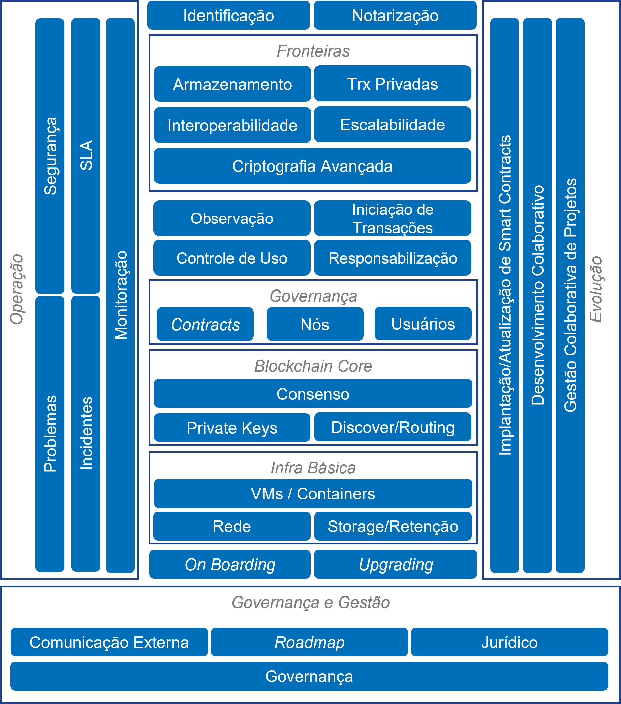

<table style="text-align: center">
<tr>
  <td style="text-align: center">
    
    
Atenção: esta página está em construção e ainda será revisada pelo Comitê Técnico da RBB

  </td>
</tr>
</table>

# Arquitetura da Rede Blockchain Brasil - RBB
- RBB é uma rede blockchain do tipo [público-permissionada](https://hal.science/hal-02477405/document)
- A implementação de blockchain utilizada na RBB é [Hyperledger Besu](https://www.hyperledger.org/use/besu).
- Hyperledger Besu é um "cliente" para redes [Ethereum](https://ethereum.org/en/developers/docs/) de código aberto (open source) mantido por [The Linux Foudantion](https://www.linuxfoundation.org/projects).
- [Hyperledger Fundation](https://www.hyperledger.org/about/join) é um dos projetos da The Linux Foundation e o Hyperledger Besu é um dos sub-projetos da Hyperledger Fundation.
- Hyperledger Besu é um dos "clientes" conhecidos para redes Ethereum. 
  - Na verdade, o dito software "cliente" para Ethereum é o software executado em um nó da rede.
  - Portanto, trata-se de uma espécie de falso cognato, já que o software é executado em nós (nodes) que formam uma rede [P2P](https://en.wikipedia.org/wiki/Peer-to-peer) 
- Nós em uuma rede Hyperledger Besu executam uma [EVM - Ethereum Virtual Machine](https://ethereum.org/en/developers/docs/evm/)
  - Isto permite a execução de [contratos inteligentes (smart contracts)](https://ethereum.org/en/developers/docs/smart-contracts/)  
- O protocolo de consenso usado na RBB é do tipo [proof of authority](https://besu.hyperledger.org/stable/private-networks/concepts/poa), sob o mecanismo [QBFT](https://besu.hyperledger.org/stable/private-networks/how-to/configure/consensus/qbft/). 
- Os nós da RBB funcionam sob topologia descrita nesta documentação arquitetural em complemento aos documentos dos [repositórios da RBB](https://github.com/RBBNet/) no GitHub.
- O objetivo deste documento é apresentar visões arquiteturais que descrevem os elementos da rede e suas interações.
- A forma com que as visões arquiteturais são definidas neste documento foi influenciada pelo Framework de Governança estabelecido para a RBB.

 

<table style="text-align: center">
<tr>
  <td style="text-align: center">
        
  </td>
</tr>
</table>

## Arquitetura

As visões arquiteturais apresentam diferentes perspectivas do design do sistema de acompanhamento de compras. 

- [Visão de infraestrutura - infra básica](arquitetura/visoes/infra-basica.md)
- [Visão de permissionamento](arquitetura/visoes/permissionamento.md)
- [Visão de monitoração](arquitetura/visoes/monitoracao.md)
- [Visão de segurança](arquitetura/visoes/seguranca.md)
- [Visão de DApps](arquitetura/visoes/dapps.md)
- [Visão de observação](arquitetura/visoes/observacao.md)

## ADRs

ADRs são documentos curtos que registram decisões de design relevantes. A ideia é contextualizar e prover a justificativa (*rationale*) da decisão. 

***Note***: *Estamos usando [este template de ADR](https://github.com/pmerson/ADR-template/blob/master/ADR-template_pt-BR.md).*

## Backlog

* Veja o [Kanban do projeto](https://github.com/orgs/RBBNet/projects/2).
