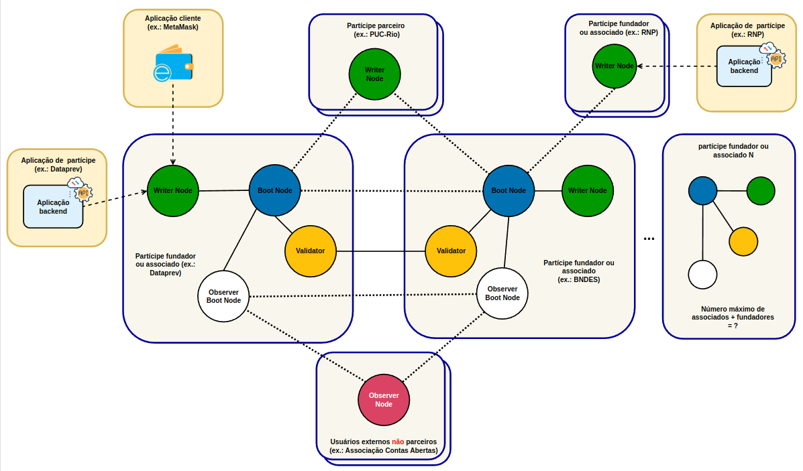
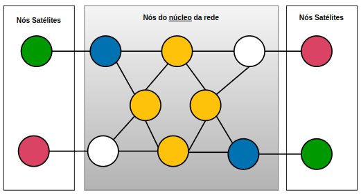
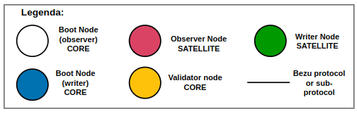

<table style="text-align: center">
<tr>
  <td style="text-align: center">
    
    
Atenção: esta página está em construção e ainda será revisada pelo Comitê Técnico da RBB

  </td>
</tr>
</table>

# Visão de Infraestrutura
- Visão de runtime que demonstra os elementos básicos da infraestrutura da rede e suas interações.

### Tipos de nós: núcleo (core nodes) e nós satélites (satellite nodes)

## Catálogo de elementos

#### Nós validadores (validator nodes)
- São considerados core nodes, indispensáveis para o funcionamento da rede.
- Participam do protocolo de consenso.
- São responsáveis por criar novos blocos de transações.
- Assinam blocos válidos usando o protocolo [QBFT](https://besu.hyperledger.org/stable/private-networks/concepts/poa)

#### Protocolo de consenso QBFT
- Protocolo proof of authority (PoA)
- Neste protocolo, contas aprovadas (approved accounts), conhecidas como "validators", validam transações e blocos.
- Apenas nós admitidos e permissionados como validadores (validators) podem propor ou validar novos blocos.
- Os nós validadores existentes podem propor e votar pela admissão de novos nós validadores e também por exclusão de nós validadores existentes.
- Não há forks ou entradas concorrentes de novos blocos na rede
  - Um novo bloco é sempre inserido ao final da cadeia de blocos (finality is instantaneous or semi-instantaneous)
- Para a rede ser considerada tolerante a falhas Bizantinas (Byzantine fault tolerant), é necessário no mínimo quatro nós validadores.  
- Se mais de 1/3 dos nós validadores tornarem-se indisponíveis, a rede para de produzir transações e blocos.
- Blocos precisam ser assinados pela maioria (2/3 ou mais) dos nós validadores.
- Quanto maior o número de nós validadores, maior o tempo para aprovação e inclusão de um novo bloco.
- Nós validadores (validators) tem um intervalo de tempo (time slot) para propor um novo bloco
  - Se o tempo deste "time slot" expirar, um novo validador será escolhido para propor um novo bloco

#### Nós conectores (boot nodes)
- São considerados core nodes.
- Servem como ligação ou ponto de acesso entre nós satélites (writers e observers) e o núcleo da rede.
- Recebem transações dos nós registradores (writers) e as repassam aos nós validadores.
- Recebem blocos de transação gerados por validadores e compartilham o histórico e o estado dos blocos com outros nós satélites (ex.: nós observadores).
- São responsáveis por admitir novos nós na rede, repassando uma lista de todos os nós ativos na rede.

#### Nós registradores (writer nodes)
- São considerados nós satélites
    - Não fazem parte do núcleo (core) da rede.
    - Não são indispensáveis ao funcionamento da rede.
- Podem enviar transações para rede.
- Usam os nós conectores (boot nodes) que repassam as transações aos nós validadores.

#### Nós observadores (observer nodes)
- São considerados nós satélites
  - Não fazem parte do núcleo (core) da rede.
  - Não são indispensáveis ao funcionamento da rede.
- Apenas leem (read only) blocos de transações da rede
- Usam os nós conectores (boot nodes) para acessar os blocos de transações da ledger.
- 
## Comportamento
- N/A.

## ADRs relacionadas
- N/A.
- 
## Visões relacionadas
- N/A.