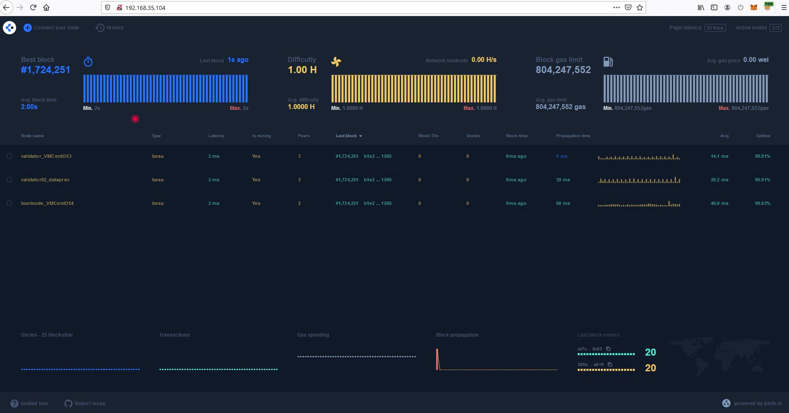

# Roteiro de Instalação do EthStats.

## EthStats 

Executar o EthStats Lite em nodes do Besu.

### Instalando o Servidor 

Obter o repositório:

~~~shell
git clone https://github.com/Alethio/ethstats-network-server.git
~~~

Ir até `/ethstats-network-server/docker/lite-mode/memory-persistence directory`:

~~~shell
cd ethstats-network-server/docker/lite-mode/memory-persistence
~~~

Atualizar o arquivo `docker-compose.yml` com o configurações da rede:

 - NETWORK_ID=648629 
 - NETWORK_NAME=RBB
 - NETSTATS_API_URL=`http://<Endereço-IP-servidor>`:3030
 - DS_URL=`<Endereço-IP-servidor>`:6020
 - DS_USER=frontend
 - DS_PASS=password

Ajustar as portas de acesso.

- ports:
 - 3000:3000
 - 3030:3030
 - 8888:8888
 - 6020:6020
 - 80:80

Arquivo fica em `ethstats-network-server/docker/lite-mode/memory-persistence/docker-compose.yml`

Conteúdo do arquivo `docker-compose.yml` utilizado:

~~~yaml
version: '3.7'
services:
  server:
    container_name: ethstats-network-server
    image: alethio/ethstats-network-server:latest
    restart: always
    depends_on:
      - deepstream
    ports:
      - 3000:3000
      - 3030:3030
      - 8888:8888
    environment:
      - NETWORK_ID=648629
      - NETWORK_NAME=RBB
      - LITE=1
      - LITE_DB_PERSIST=0
      - LITE_API_PORT=3030
      - APP_PORT=3000
      - METRICS_PORT=8888
      - DEEPSTREAM_HOST=deepstream
    command: ["./bin/app.js", "-v"]
  deepstream:
    container_name: ethstats-network-deepstream
    image: deepstreamio/deepstream.io:3.2.2
    restart: always
    ports:
      - 6020:6020
  dashboard:
    container_name: ethstats-network-dashboard
    image: alethio/ethstats-network-dashboard:latest
    restart: always
    depends_on:
      - server
    volumes:
      - ../../config/nginx/conf.d:/etc/nginx/conf.d
    ports:
      - 80:80
    environment:
      - NETSTATS_API_URL=http://<Endereço-IP-servidor>:3030
      - DS_URL=<Endereço-IP-servidor>:6020
      - DS_USER=frontend
      - DS_PASS=password
~~~

Iniciar o servidor EthStats com Docker compose:

~~~shell
docker-compose up -d
~~~

Acessar o dashboard em: `http://<IP-Ou-nome-servidor>` no navegador.

### Iniciando o cliente nos nodes da rede.

Para adaptar o cliente para se comunicar com a nossa rede do Laboratório, foi necessário realizar os seguintes procedimentos em cada um dos servidores (bootnode, writer e validators):

1- Parar/Remover container que esteja em execução com o cliente

~~~shell
# Consultar processos em execução com docker ps
docker ps 
CONTAINER ID   IMAGE                  COMMAND                  CREATED       STATUS       PORTS                    NAMES
3e68206d5644   alethio/ethstats-cli   "./bin/ethstats-cli.…"   5 weeks ago   Up 12 days                            silly_wiles

# Parar o container
docker stop 3e68206d5644
docker rm 3e68206d5644
~~~

2- Caso esteja seguinto o roteiro de instalação utilizando o rbb-cli:
  
  2.1 :  rbb-cli:

~~~shell
  ./rbb-cli config set nodes.validator.ports+=[\"4546:4546\"]
  ./rbb-cli config set nodes.validator.environment.BESU_RPC_WS_ENABLED=true
  ./rbb-cli config set nodes.validator.environment.BESU_RPC_WS_PORT=4546
  ./rbb-cli config render-templates

~~~

  2.2 : Caso contrário, criar as variáveis de ambiente no docker-compose (`docker-compose.yml`)

- environment:
      BESU_RPC_WS_ENABLED: "true"
      BESU_RPC_WS_PORT: "4546"
- ports:
      - 4546:4546

docker-compose up -d

3- Modificar no arquivo `/opt/ethstats-cli/ethstats-cli.json`, o `secretKey` com a senha de acesso ao servidor EthStats (configurado em `DS_PASS`) e `firstRun` para `true`.

~~~shell
    "secretKey": "SenhaDeAcessoAoEthstatsServer",
    "firstRun": true
~~~

3-Iniciar nova instância do `alethio/ethstats-cli`, passando as configurações:

* --node-name
* --account-email 
* --server-url 
* --client-url

Exemplo:

~~~shell
docker run -d --restart always --net host -v /opt/ethstats-cli/:/root/.config/configstore/ alethio/ethstats-cli --register --account-email rbb@exemplo.gov.br --node-name "<nome do nó>" --server-url http://<Endereço-IP-servidor-ethstats>:3000 --client-url ws://127.0.0.1:4546
~~~

Com tudo configurado adequadamente espera-se obter uma tela parecida com a imagem abaixo:

##### EthStats da Rede Teste RBB

